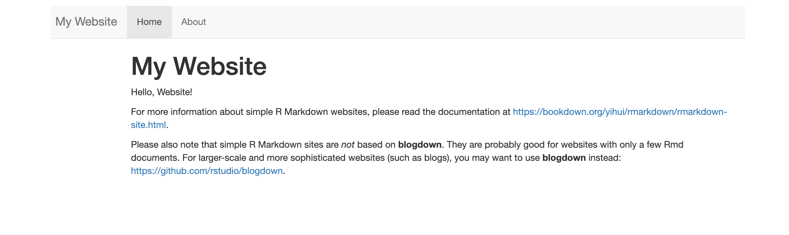
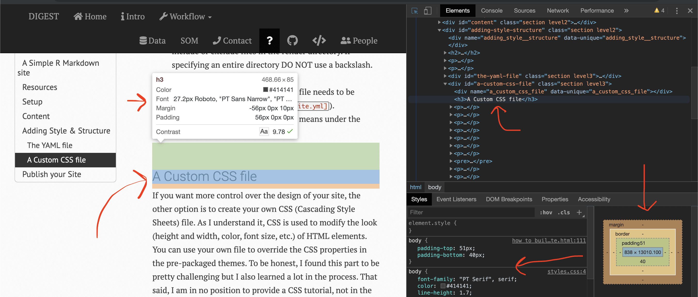

***
## Motivation

I am a novice---this is my first website---so I thought it would be cool to document the process of making this website. You may know there are many (many) ways to construct a website, and while this is  not a tutorial, it should be useful for people already working in R and/or RStudio (or planning to) but who have little/no experience in making a website.

My goal with this project was simple: I had all of this data that I was analyzing in R and I wanted to create workflows, reports, etc., that could be shared with other people. This lead me to RStudio and to R Markdown documents; here I could generate reproducible workflows and interactive documents, save the workflows as HTML files, and share the HTML files. Since anyone with a web browser can open an HTML document, I didn't need to worry if someone understood R or had RStudio. Once I had several HTML workflows I figured it would be a good idea to make a website so that I had a place to keep everything organized and accessible.

## A Simple R Markdown site

So basically I used:

* [R](https://www.r-project.org) code to process and analyze data,
* [Rmarkdown](https://rmarkdown.rstudio.com/) framework to save/execute code and generate high quality HTML reports,
* [RStudio](https://rstudio.com/) and [kitr](https://yihui.name/knitr/) to render the site,
* [GitHub](https://github.com/) for version control, and
* [GitHub Pages](https://pages.github.com/) for hosting site.

I  scoured the internet for solutions and for inspiration. My design is based partly on [the Meren Lab](http://merenlab.org/) website, itself a derivation of [MM](http://mademistakes.com/minimal-mistakes/). I liked the use of white space (large margins), clean font (PT Sans & PT Serif), ample spacing between lines and words, and the use of colored boxes to call out important stuff. There are also many little touches on the site that I appreciate, some of which I shamelessly copied  The developers also provide instructions on how to [run their site locally](https://github.com/merenlab/web#how-to-run-a-copy-of-this-website-locally). Nice job Meren Lab.

After searching for the "perfect" template, I decided to take a simpler approach and start with the default website builder package in RStudio. It is bare bones---which is nice because it allowed me to learn as I went along rather than trying to back engineer my understanding from an already tricked out site. The process helped me appreciate both how little I needed  to make a website AND how I could add a little jazz. So I started with the default configuration, then played around with the YAML file, and finally made my own custom CSS file to customize the site.

<div class="warning">
There are drawbacks to using the Simple R Markdown Website approach. The main one is that  the site generator assumes all the `.Rmd` documents are under a flat directory (i.e., no pages under sub directories). This means it is difficult to organize websites with a lot of content. There are additional shortcomings with this platform that are worth investigating.
</div>

## Resources

Before proceeding I wanted to share some of the resources I returned to over and over again.

* [Interneting is Hard](https://internetingishard.com/): Badass, free HTML and CSS course. If you plan on doing any website coding at all, I suggest you start here (or with something similar).
* [Stack Overflow](https://stackoverflow.com/): Indispensable community forum where pretty much any question you have has probably been asked and answered.
* [Atom](https://atom.io): My go-to text editor for writing HTML, CSS, etc.
* [scratchpad.io](http://scratchpad.io/): A realtime HTML + CSS editor. Pretty sweet.
* [w3schools](https://www.w3schools.com/): Great resource for learning language elements.
* [MDN web docs](https://developer.mozilla.org/en-US/): Another great resource for learning language elements.
* [Canva color wheel](https://www.canva.com/colors/color-wheel/): Cool app for choosing colors and color combinations.
* [HTML Entities](https://dev.w3.org/html5/html-author/charref): List of HTML entities and their codes.

## Setup

The first thing you want to do is fire up RStudio and go to `File > New Project`. A popup window appears and gives you three options (at least on my setup) for Creating a New Project; New Directory, Existing Directory, or Version Control. The New and Existing Directory choices are pretty much the same---use the later if you already have some `.Rmd` files. The Version Control choice is recommended by a lot of tutorials because it facilitates Git integration. But since I am a beginner I thought it would be nice to learn Git through the command line interface (CLI.)  So all version control here is done through the CLI rather than RStudio. Version control is discussed below.

Anyway, chose `New Directory > Simple R Markdown Website`, give it a name and figure out where you want it to live. Let's call it `mock_site`. Then hit `Create Project`.

Now you have a new directory called `mock_site/` with the following files:

```{r list, echo=FALSE, cache=TRUE}
list.files("/Users/rad/github/PROJECT_DIGEST/web/build/mock_site")
```

And that's it. At this point you can render the site by running:

```
rmarkdown::render_site()
```

The site generator makes a new directory called `_site/`, which  contains all the info needed for the actual website.

```{r list_2,  echo=FALSE, cache=TRUE}
list.files("/Users/rad/github/PROJECT_DIGEST/web/build/mock_site/_site")
```

As you can see the directory has `.html` versions of  the `.Rmd` files (in this case just two), a `_site.yml` file (discussed below), and a directory called `site_libs/`---a directory that has a bunch of `.js` and `.css` files. These files dictate the look and action of the site.  Every time you render the site, the entire `_site/` directory and its contents are rebuilt. As far as I know there is no reason you should ever need to mess with this directory or its contents. If you go into the `_site/` and open `index.html` you can see the site in a browser. Super simple---a couple of tabs, a header, a few links, nada mas. But a website nonetheless (albeit a bit boring).

<br/>

<a href="#minimal">
  
</a>

<a href="#_" class="lightbox" id="minimal">
  
</a>

<br/>

FYI, this image is expandable. Click the image to expand to the full screen and click again to return to the main page. This is called a lightbox and I modifed the [Pure CSS Lightbox](https://codepen.io/gschier/pen/HCoqh) code and added it to the `style.css` file. The only thing I do not like is how you can still scroll when the image is enlarged. I need to figure out how to fix that.

<div class = "notice">
So are you happy with the super default settings? If so, move on to the Content section and then Publish your Site. If not, I recommend skipping the content at first and instead focusing on Adding Style & Structure to your site. I say this because tweaking a  site with minimal content is  easier than messing with a full blown workflow (speaking from experience). This is primarily because render times of minimal sites are quick and it may be simpler to identify the effects of modifications.
</div>

## Content

The minimum you need for an R Markdown website are the `_site.yml` and `index.Rmd` files. The index file and any other R Markdown files contain the content and the YAML file has the site parametersd. The engine uses these files in conjunction with the library to build the site.

So the first thing you do is write all the code and text in R Markdown files (`.Rmd`)---basically [markdown](https://en.wikipedia.org/wiki/Markdown) (an easy-to-write plain text format) with R code functionality added in. When you render the site, RStudio and knitr will run all the code and R Markdown text and spit out an `.html` file with tables, graphs, code, whatever you put in the `.Rmd` file. Later you can `cache` all the code chunks so you don't need to run all the code every time the site is rendered. A tutorial on R and R Markdown is beyond the scope of this humble page but there are a lot of resources to help you on your way.

The basic structure of the `.Rmd` file is super simple. The title of the page between to rows of three consecutive dashes followed by you content.  Lets open the `about.Rmd` file and have look.

```
---
title: "About This Website"
---

Content: Lots of beautiful code, creative analyses, poetic prose...written in R, R Markdown, html, etc.
```

While this file is open feel free to add some content, change the title, whatever. Then save the file, rerun  `rmarkdown::render_site()`, and open the `_site/index.html` file. Boom. Updated website. Pretty slick. If fact every time you add or change something, save the file and run the render command again. You can even just render a single page if the rest are done, so you don't have to re-render the whole dang thing. Like so...`rmarkdown::render_site("about.Rmd")`

So the base of your website will be different pages written like this and saved as `.Rmd` files. The `.Rmd` files will likely be a mix of text and R code but you can also make a site without any R code at all. Anyway, I will leave the rest of this part up to you...

For now, lets say you want a website with four pages.
* `index.Rmd` This will be the landing or home page of the site.
* `about.Rmd` A page about you or the project.
* `processing.Rmd` A page that has the processing workflow (e.g.,  [DADA2](https://benjjneb.github.io/dada2/index.html)).
* `analytical.Rmd` A page that has the analytical workflow (e.g., [phyloseq](https://joey711.github.io/phyloseq/)).

OK, you have all your content and are ready to build the website. But before you do that you need to tell knitr about the new pages. The engine will automatically render all `.Rmd` files to `.html` but unless you instruct knitr what to do with the additional files, you will not have any links on the site. Lets open up the `_site.yml` file (located in the main directory) and have a look.

```
name: "my-website"
navbar:
  title: "My Website"
  left:
    - text: "Home"
      href: index.html
    - text: "About"
      href: about.html
```

You can see that the YAML file contains this thing called `navbar`---this is the navigation bar on the top of each page that links to all the pages on the site. You need to add the two new pages. The basic info you should provide is the name of the new page and the name of the file. The page name can be anything while the file name needs to be the actual file name, and with the `.html` extension, **not** the `.Rmd` extension.

Now it should look something like this:

```
name: "my-website"
navbar:
  title: "My Website"
  left:
    - text: "Home"
      href: index.html
    - text: "About"
      href: about.html
    - text: "Rad Processing Workflow"
      href: processing.html
    - text: "Goose Gossage"
      href: analytical.html
```

Whatever. That's it. Assuming your code ran successfully and you got a message after rendering like this...
`Output created: _site/index.html`
...your website done. Now you can publish it, tweet about it, and tell your sweet Grandpa to check it out. Below I discuss how I published this site using GitHub and GitPages. I will leave the tweeting and telling Grandpa up to you.

## Adding Style & Structure

But maybe  you want something more than the super default site.  Awesome. The method you choose will depend a lot on what you want and how much time you are willing to invest. As I understand it, you can customize the pre-packaged, Simple R Markdown Website  using the YAML file.

### The YAML file

Perhaps the most straightforward approach to configuring your site is to trick out the `_site.yml` file. In fact, the YAML file offers a high degree of customiztion and there are several ways to configure a website using just the  YAML file. We will go through a couple here.

The first is to simply use one of the other pre-packaged themes. In addition to the default theme, the other valid themes are cerulean, journal, flatly, darkly, readable, spacelab, united, cosmo, lumen, paper, sandstone, simplex, and yeti. Each has their own font style, coloring, layout, etc. You can see examples of each theme [here](http://www.datadreaming.org/post/r-markdown-theme-gallery/) but I suggest playing around with these yourself. To do this you need to again open the `_site.yml` file and add a few more lines of code (minding the indention levels). Say you want to check out the  **flatly** theme. Add this...

```
output:
  html_document:
    theme: flatly
```

Now when you render the site it will have the *flatly* theme. You can see what the different themes look like by swaping out that value and re-rendering the site (this is where a simple site comes in handy).

Another tweak using YAML is to change the way syntax is highlighted---that is the way R code chunks, inline code, code outputs, etc., appear in your final document. The current pre-packaged highlight themes are default, tango, pygments, kate, monochrome, espresso, zenburn, haddock, breezedark, and textmate. Its worth noting that you can also use `null` to prevent syntax highlighting. To specify  highlighting add the following:

```
output:
  html_document:
    theme: flatly
    highlight: zenburn
```

There are other ways you can use the YAML file to modify the look of your site. To figure out all(?) of the YAML options available for html documents, I encourage you to check out the help page:

```
?rmarkdown::html_document
```

For an intro to the topic of modifying the YAML file, see the awesome book [R Markdown: The Definitive Guide](https://bookdown.org/yihui/rmarkdown/html-document.html#appearance_and_style) by *Yihui Xie, J. J. Allaire, Garrett Grolemund*. If you dig deep enough however, you may soon reach the limits of using the YAML file to modify your site.


### A Custom CSS file

If you want more control over the design of your site, the other option is to create your own CSS (Cascading Style Sheets) file. As I understand it, CSS is used to modify the characteristics (height and width, color, font size, etc.) of HTML elements. You can use your own file to override the CSS properties in the pre-packaged themes. To be honest, I found this part to be pretty challenging but I also learned a lot in the process. That said, I am in no position to provide a CSS tutorial, not in the slightest. But from one novice to another, I can give you a little advice if you're interested in going down this road. The best way to go is to take an online course to properly learn CSS (preferred) or you can do what I did and slog your way through it.

My general idea was to  figure out what elements I wanted to change (or create) and then to figure out how to do it. My not so sophisticated approach was to change something and render the site, then see what the change did (if it did anything at all). So yeah, that was my plan.

In order to change an element you need to know what its called and what modifications you can make to it. For example, lets say you want to change the font size of Header #3 to 50px and its color to pink. What you need to do is write a little CSS code that calls up Header #3 and specifies these values.

For me the best way to figure out the pieces you need for making your own CSS code is to open the  website in Chrome then click `View > Developer > Inspect Elements` (I assume other browsers have this capability). When you hover the mouse over the part you are interested in modifying, a little box of details pops up on the left and the HTML code on the right moves to that code block.


<a href="#inspect">
  
</a>

<a href="#_" class="lightbox" id="inspect">
  
</a>


Here we see that the name of the element is `h3`. We can also see several additional properties including color and size. To modify this tag we write a little code like this:

```
h3 {
font-size: 50px;
font-color: #ffc0cb
}
```

Another thing you can do is add an element. I wanted some colored boxes to call out important details like notices and warnings. So I made an element called `warning` and after consulting some threads on [StackOverFlow](https://stackoverflow.com){target="blank}, coded it up like so:

```
.warning{
  background-color:#F1AFAE;
  border-radius: 5px;
  padding: 10px;
  margin: 18px 0;
  font-size: 4
}
```

All of this needs to be saved in a single file, for example `styles.css`, in the main directory. And the last thing to do is add this file name to the YAML file so the engine knows to read CSS code from this file as well.

```
output:
  html_document:
    theme: flatly
    highlight: zenburn
    css: styles.css
```

CSS is an entire language and you certainly can't expect to master it overnight. But I think it can be used effectively to make some nice modifications to your site.

## Publish your Site

I chose to host this site on [GitHub Pages](https://pages.github.com/){target="_blank"} because I thought it would be pretty straightforward. The only thing you really need is a GitHub account (which is free) and away you go. There is a complete walkthrough on set up on the GitHub Pages website. Of course there are many other hosting options out there and you may find something more suited to your needs. 


At some point I may make this a more complete tutorial with step-by-step instructions that include setup on GitHub. But at this moment (1621 hours on a Thursday) I can't do battle with GitHub anymore. That creepy cat silhouette beat me for now...

