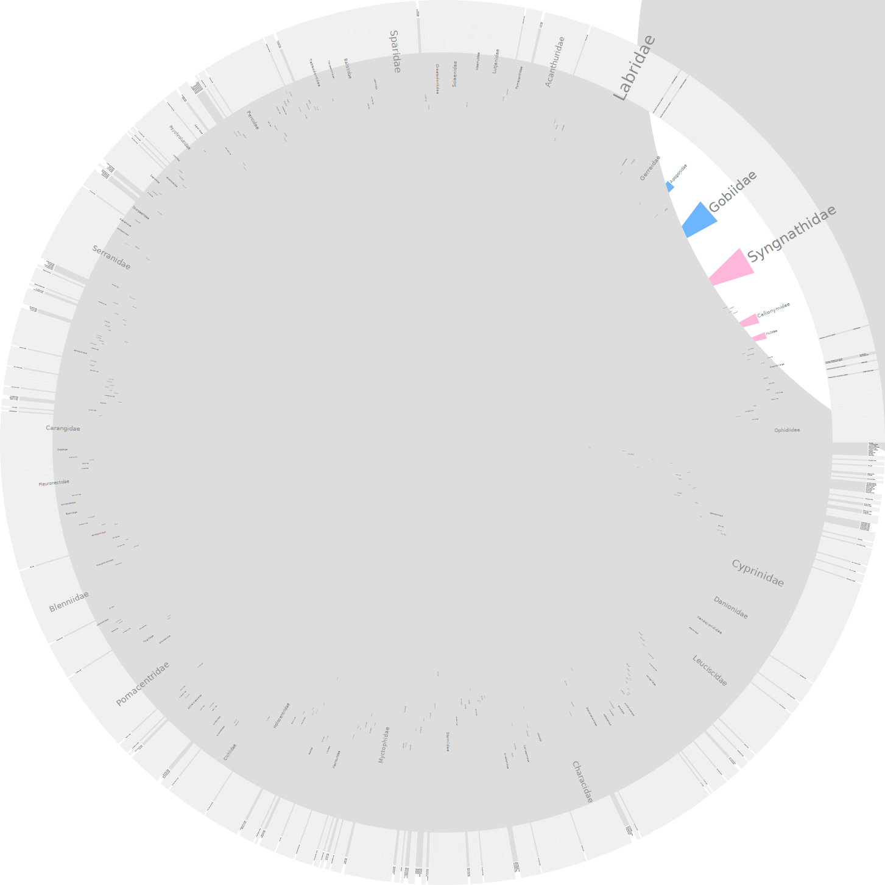

This website provides a completely reproducible workflow of our [study](publication.html){target="_new"} on the intestinal microbial communities from five species of herbivorous coral reef fishes. The workflow goes through the steps we used to process the raw 16S rRNA marker data and the various tools we used to analyze and interpret  the data. With this workflow you can generate the figures and tables from the paper as well as many additional data products. The workflow is written in R Markdown and contains a mixture plain text and R code. Anyone should be able to reproduce our results with just this workflow and the raw data.

## About this Site

The navigation bar at the top contains links to workflows, data/data products, supplementary material from the paper (see SOM), and a variety of other useful information. The site itself has many dynamic components. For example, you can sort and scroll through most of the tables, several figures expand when clicked, and one figure is zoomable. All figures and tables from the final publication are highlighted in red font to make them easy to identify. You can choose to show or hide the R code using the `Code` button in the upper right hand corner of each page (default is mostly hide).  An unannotated version of the R code is available for download using the navbar link.

 

  
    <button class="favorite styled" type="button">
      <a href="0_pw_intro.html">Proceed to Workflow</a>
    </button>
  

## About the Banner

>The banner contains images of the 5 species examined in this study. From left to right these are: *Acanthurus bahianus/Acanthurus tractus*, *Acanthurus coeruleus*, *Scarus taeniopterus*,  *Sparisoma aurofrenatum*, and *Sparisoma viride* (see below for image credits). It also contains some images of figures from the paper and in the middle, part of a huge bony fish phylogeny. If you click on the banner you can see the full tree. 

One  of our [analyses](6_synthesis.html#asvs__host_trait_correlation){target="_new"} required us to create a phylogenetic tree of the five host species. To construct the tree we first needed an appropriate out group. Our search for an  out group  lead to [DeepFin](https://sites.google.com/site/guilleorti/){target="_new"} and the amazing paper by [Betancur-R et. al., (2017)](https://link.springer.com/article/10.1186/s12862-017-0958-3){target="_new"} on the phylogenetic classification of bony fishes. The tree in this paper is the 4th version (the original dates back to 2013) and is based on the phylogeny of a whopping 1990 species encompassing 72 orders and 410 families. Wow. In our study, we looked at intestinal microbes  from five fish species across two families.

Anyway, we used the original tree from the paper to choose an out group for our analysis (Gerreidae) and for the fun of it  decided to make our own representation of the Betancur-R et. al., tree. To construct the tree above we first downloaded the newick file from the paper's supplementary material ([download link](https://static-content.springer.com/esm/art%3A10.1186%2Fs12862-017-0958-3/MediaObjects/12862_2017_958_MOESM2_ESM.tre){target="_new"}), parsed out the Family data from the tree file (included in the name of each leaf), and finally visualized the tree in [anvi'o](http://merenlab.org/software/anvio/){target="_new"}. Within the anvi'o interface we visualized the tree as a circular phylogram and collapsed any Family represented by two or more species. The size of each triangle is proportional to the number of species in that family while the colors are somewhat arbitrary. Originally we thought it would be cool to color leaves by the taxa but that was too complicated. So the colors are really just for looks. The families we studied in this project are in the lower left, marked by asterisks. In the future we would like to identify which fish families have been the subject of microbial investigations and use the phylogenetic framework to identify gaps in knowledge and patterns of associations.

> You can download a full SVG version by clicking on the banner. Or you can download the files we used to make the tree from this [GitHub repo](https://github.com/projectdigest/betancur_r-fish-tree){target="_new"} and then use anvi'o to make an even better tree.

<small>
<em>All banner photos on this page were retreived from Wikimedia Commons and Licensed under Creative Commons Attributions. Each photo was modified from the originals by removing the background</em>.

**Banner photos from left to right**: <em>Acanthurus bahianus/Acanthurus tractus </em><a href="https://commons.wikimedia.org/wiki/Category:Acanthurus_bahianus#/media/File:Acanthurus_bahianus_SI2.jpg">(original)</a> licenced under <a href="https://creativecommons.org/share-your-work/public-domain/cc0">CC-0</a>; <em>Acanthurus coeruleus </em><a href="https://commons.wikimedia.org/wiki/File:Fish13092009a.jpg">(original)</a> by Sylfred1977 licenced under <a href="https://creativecommons.org/licenses/by-sa/3.0/">CC-BY-SA-3.0</a>; <em>Scarus taeniopterus</em> (Desmarest 1831) <a href="https://commons.wikimedia.org/wiki/File:Scarus_taeniopterus_-_pone.0010676.g130.png">(original)</a>, <em>Sparisoma aurofrenatum</em> (Valenciennes, 1840) <a href="https://commons.wikimedia.org/wiki/File:Sparisoma_aurofrenatum_-_pone.0010676.g133.png">(original)</a>, and <em>Sparisoma viride</em> (Bonnaterre, 1788) <a href="https://commons.wikimedia.org/wiki/File:Stoplight-parrotfish.jpg">(original)</a> all licenced under <a href="https://creativecommons.org/licenses/by/2.5/">CC-BY-2.5</a> by <a href="https://doi.org/10.1371/journal.pone.0010676">Williams et. al., 2010</a>.
</small>

<!--

<pre>
for species in `cat list.txt`;
do
  pysradb search --db /pool/genomics/stri_istmobiome/dbs/pysradb/SRAmetadb.sqlite "$species" --desc --expand |& tee -a results.txt;
done
</pre>
-->

<!--

-->
